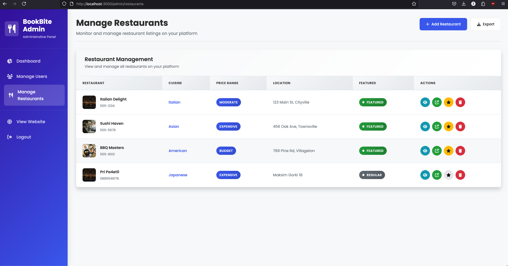

# BookBite - Restaurant Reservation System 🍽️

BookBite is a comprehensive restaurant reservation system featuring email confirmation workflows, user authentication, and modern web technologies. The system consists of a robust C++ backend using the Crow framework and a responsive Node.js/Express frontend with EJS templating.

## 🌟 Features

### Core Functionality
- **User Registration & Authentication** - Secure user accounts with JWT token-based authentication
- **Restaurant Discovery** - Browse restaurants with detailed information, ratings, and images
- **Table Reservation System** - Real-time table availability and booking with email confirmation
- **Review System** - Rate and review restaurants with star ratings
- **Admin Dashboard** - Complete restaurant and user management interface
- **Email Confirmations** - Automated email notifications for reservations and account verification

### User Features
- User registration with email verification
- Browse restaurants by cuisine type, rating, and location
- View restaurant details with table availability
- Make reservations with special requests
- Manage personal reservations (view, cancel)
- Write and edit restaurant reviews
- Responsive design for mobile and desktop

### Admin Features
- Restaurant management (create, update, delete)
- User management with role-based permissions
- Reservation management and monitoring
- System analytics and audit logs
- Table management for restaurants

## 📸 Application Screenshots

### Main Page


### Restaurant Browsing


### Restaurant Details & Reviews


### Reservation System


### Admin Dashboard




## 🏗️ Project Structure

```
bookbite/
├── backend/                    # C++ API Server
│   ├── include/               # Header files
│   │   ├── businessLogic/     # Service layer (auth, restaurant, reservation, review)
│   │   ├── dataAccess/        # Database access layer
│   │   ├── models/            # Data models (User, Restaurant, Reservation, etc.)
│   │   ├── presentation/      # API controllers
│   │   └── utils/             # Utilities (email, database connection, env loader)
│   ├── src/                   # Source files
│   │   ├── main.cpp           # Application entry point
│   │   └── [mirrors include structure]
│   ├── build/                 # Build directory
│   └── CMakeLists.txt        # Build configuration
├── frontend/                  # Node.js/Express Frontend
│   ├── views/                 # EJS templates
│   │   ├── pages/            # Page templates
│   │   ├── partials/         # Reusable components
│   │   └── layouts/          # Layout templates
│   ├── public/               # Static assets (CSS, JS, images)
│   ├── app.js                # Express application
│   └── package.json          # Dependencies
├── diagrams/                  # System documentation
│   ├── entity-relationship-diagram.png
│   ├── sequence-diagram.png
│   ├── activity-diagram.png
│   ├── use-case-diagram.png
│   └── file-structure-diagram.png
├── bookbite.sql              # Database schema
└── README.md                 # This file
```

## 🛠️ Technology Stack

### Backend (C++)
- **Framework**: Crow (Modern C++ web framework)
- **Database**: MySQL with nanodbc connectivity
- **Authentication**: JWT tokens with bcrypt password hashing
- **Email**: CURL-based SMTP client with Gmail integration
- **JSON**: nlohmann/json for API responses
- **Security**: OpenSSL for cryptographic operations
- **Build System**: CMake

### Frontend (Node.js)
- **Framework**: Express.js with EJS templating
- **Session Management**: MySQL session store
- **Styling**: Bootstrap 5 with custom CSS
- **Icons**: Font Awesome
- **HTTP Client**: Axios for API communication
- **Image Service**: Unsplash API integration

### Database
- **MySQL/MariaDB** with the following main tables:
  - `users` - User accounts and authentication
  - `restaurants` - Restaurant information and metadata
  - `tables` - Restaurant seating arrangements
  - `reservations` - Booking information and status
  - `reviews` - User reviews and ratings
  - `user_roles` - Role-based access control
  - `auth_tokens` - JWT token management

## 🚀 Getting Started

### Prerequisites
- **C++ Compiler** (GCC 7+ or Clang 6+)
- **CMake** (3.12+)
- **Node.js** (14+) and npm
- **MySQL/MariaDB** server
- **Dependencies for C++ backend**:
  - Crow framework
  - nanodbc
  - OpenSSL
  - CURL
  - nlohmann/json

> **Note**: This project has been tested and verified to work on **macOS Tahoe Developer Beta 1**

### Database Setup
1. Install MySQL/MariaDB
2. Create the database:
   ```sql
   CREATE DATABASE bookbite;
   ```
3. Import the schema:
   ```bash
   mysql -u root -p bookbite < bookbite.sql
   ```

### Backend Setup
1. Navigate to the backend directory:
   ```bash
   cd backend
   ```

2. Install dependencies (macOS with Homebrew):
   ```bash
   brew install cmake nanodbc unixodbc openssl curl nlohmann-json
   ```

3. Create build directory and configure:
   ```bash
   mkdir build
   cd build
   cmake ..
   ```

4. Build the project:
   ```bash
   make
   ```

5. Create a `.env` file in the build directory:
   ```env
   DB_HOST=localhost
   DB_PORT=3306
   DB_USER=root
   DB_PASSWORD=your_password
   DB_NAME=bookbite
   SMTP_SERVER=smtp.gmail.com
   SMTP_PORT=587
   SMTP_USER=your_email@gmail.com
   SMTP_PASSWORD=your_app_password
   ```

6. Run the backend server:
   ```bash
   ./bookbite_server
   ```
   The backend API will be available at `http://localhost:8080/api`

### Frontend Setup
1. Navigate to the frontend directory:
   ```bash
   cd frontend
   ```

2. Install dependencies:
   ```bash
   npm install
   ```

3. Create a `.env` file:
   ```env
   PORT=3000
   API_URL=http://localhost:8080/api
   DB_HOST=localhost
   DB_PORT=3306
   DB_USER=root
   DB_PASSWORD=your_password
   DB_NAME=bookbite
   SESSION_SECRET=your_session_secret
   ```

4. Start the frontend server:
   ```bash
   npm run dev
   ```
   The frontend will be available at `http://localhost:3000`

## 📊 System Architecture

### Entity Relationship Diagram


The system uses a normalized database schema with proper foreign key relationships:
- Users can have multiple reservations and reviews
- Restaurants have multiple tables and receive reviews
- Tables belong to restaurants and can have multiple reservations
- Reservations link users, restaurants, and tables

### Use Case Diagram


The system supports different user roles:
- **Guest Users**: Browse restaurants, view details
- **Registered Users**: Make reservations, write reviews, manage bookings
- **Administrators**: Full system management capabilities

### Activity Diagram


Shows the complete reservation workflow from browsing to confirmation.

### Sequence Diagram


Illustrates the interaction between frontend, backend, and database components.

## 📧 Email Configuration

The system uses Gmail SMTP for sending emails. To configure:

1. Enable 2-factor authentication on your Gmail account
2. Generate an App Password:
   - Go to Google Account settings
   - Security → 2-Step Verification → App passwords
   - Generate password for "Mail"
3. Use the app password in your `.env` file

Email features include:
- Account verification emails
- Reservation confirmation emails
- Reservation reminder emails
- Password reset emails (if implemented)

## 📚 API Documentation

### Authentication Endpoints
- `POST /api/auth/register` - Register new user
- `POST /api/auth/login` - User login
- `POST /api/auth/logout` - User logout
- `GET /api/auth/verify-email/{token}` - Verify email address

### Restaurant Endpoints
- `GET /api/restaurants` - List all restaurants
- `GET /api/restaurants/{id}` - Get restaurant details
- `GET /api/restaurants/{id}/tables` - Get restaurant tables
- `GET /api/restaurants/{id}/reviews` - Get restaurant reviews

### Reservation Endpoints
- `POST /api/reservations` - Create new reservation
- `GET /api/user/reservations` - Get user's reservations
- `POST /api/reservations/{id}/cancel` - Cancel reservation
- `GET /api/reservations/confirm/{token}` - Confirm reservation

### Admin Endpoints
- `GET /api/admin/users` - Manage users
- `GET /api/admin/restaurants` - Manage restaurants
- `GET /api/admin/reservations` - Manage reservations
- `POST /api/admin/restaurants` - Create restaurant

## 💫 Email Confirmation Workflow

1. **User Registration**:
   - User registers with email
   - System sends verification email
   - User clicks verification link
   - Account becomes active

2. **Reservation Process**:
   - User makes reservation
   - System sends confirmation email with token
   - User clicks confirmation link
   - Reservation status changes to "confirmed"

## 🔧 Development

### Building the Backend
The C++ backend uses CMake and requires several dependencies. The build process automatically:
- Fetches the Crow framework if not installed
- Links against MySQL/ODBC drivers
- Configures SSL and CURL libraries
- Copies the executable to the project root

### Frontend Development
The Express.js frontend provides:
- Server-side rendering with EJS
- Session management with MySQL store
- API proxy to the C++ backend
- CORS handling for development

### File Structure


The project follows a clean architecture pattern:
- **Models**: Data structures and entities
- **Data Access**: Database operations and queries
- **Business Logic**: Core application logic and rules
- **Presentation**: API controllers and routing
- **Utils**: Helper functions and utilities

## 📋 Common Issues

### Backend Issues
- **Database Connection**: Ensure MySQL is running and credentials are correct
- **ODBC Drivers**: Install MariaDB ODBC driver for macOS
- **SSL Certificates**: May need to configure SSL certificate paths

### Frontend Issues
- **Session Store**: Requires MySQL connection for session storage
- **API Communication**: Ensure backend is running on port 8080
- **Image Loading**: Unsplash integration requires internet connection

### Email Issues
- **SMTP Authentication**: Use App Passwords for Gmail
- **Firewall**: Ensure SMTP port 587 is not blocked
- **Email Delivery**: Check spam folders for confirmation emails

## 📄 License

This project is licensed under the MIT License - see the LICENSE file for details.

---

**BookBite** - Making restaurant reservations simple and elegant! 🎉

---

Made with ❤️ by Boris Milev
